# 📚 Schedule App – "Focus"

A smart and user-friendly mobile app designed to help students efficiently manage their study time by creating optimized schedules based on subject importance, available hours, and personal preferences.

---

## 🧠 Project Overview

**Focus** is a productivity tool tailored specifically for students struggling with time management. The app generates customized study schedules using input like credit hours, study availability, and subject preferences. It prioritizes higher credit hour subjects and strategically allocates them during the student's most focused periods or days off.

---

## 🚀 Features

- 📆 Weekly schedule creation
- 📚 Add subjects with credit hours
- 🧠 Prioritize subjects based on importance
- 🗓️ Set your available study times and days off
- 🔒 Secure login, signup, and password reset
- 🌈 Clean and vibrant user interface
- 👤 Personal profile screen
- 💬 Help & Support section
- 💾 Save schedules locally
- 📤 Share the app with friends

---

## 🧩 App Screens

- **Intro Screen**  
  
  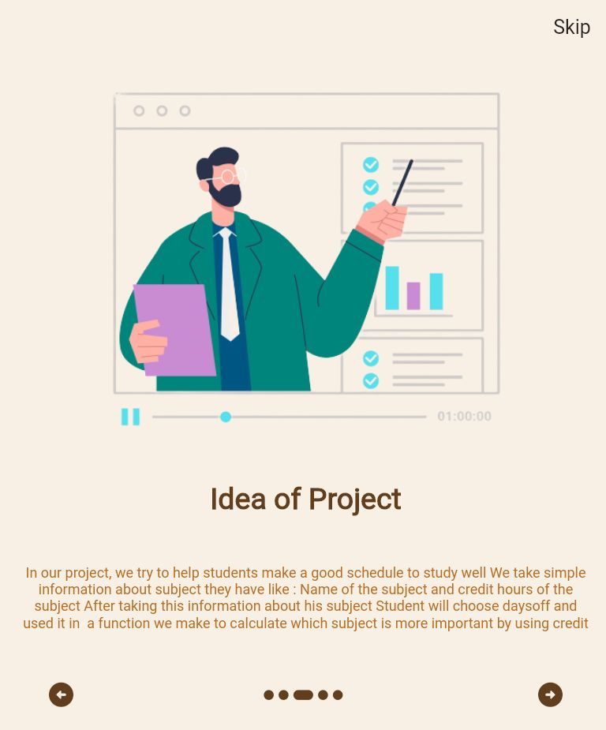
  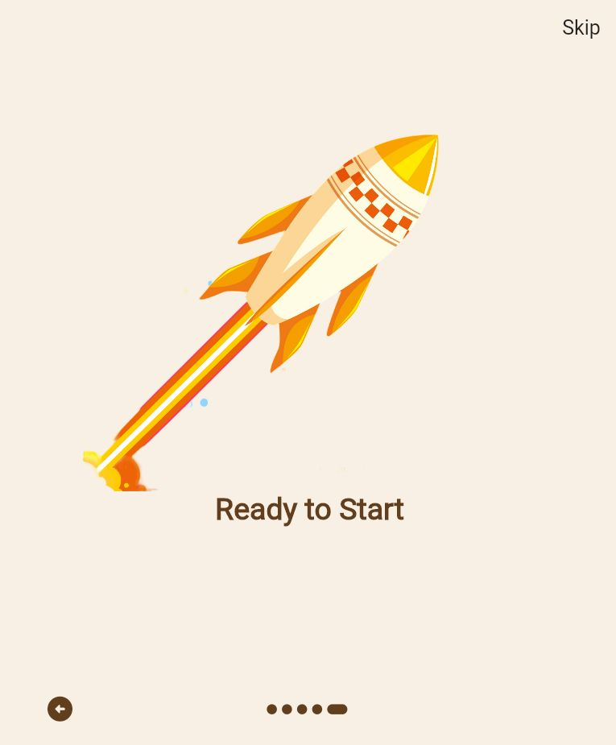
- **Authentication Screens** (Login, Signup, Forget Password)  
  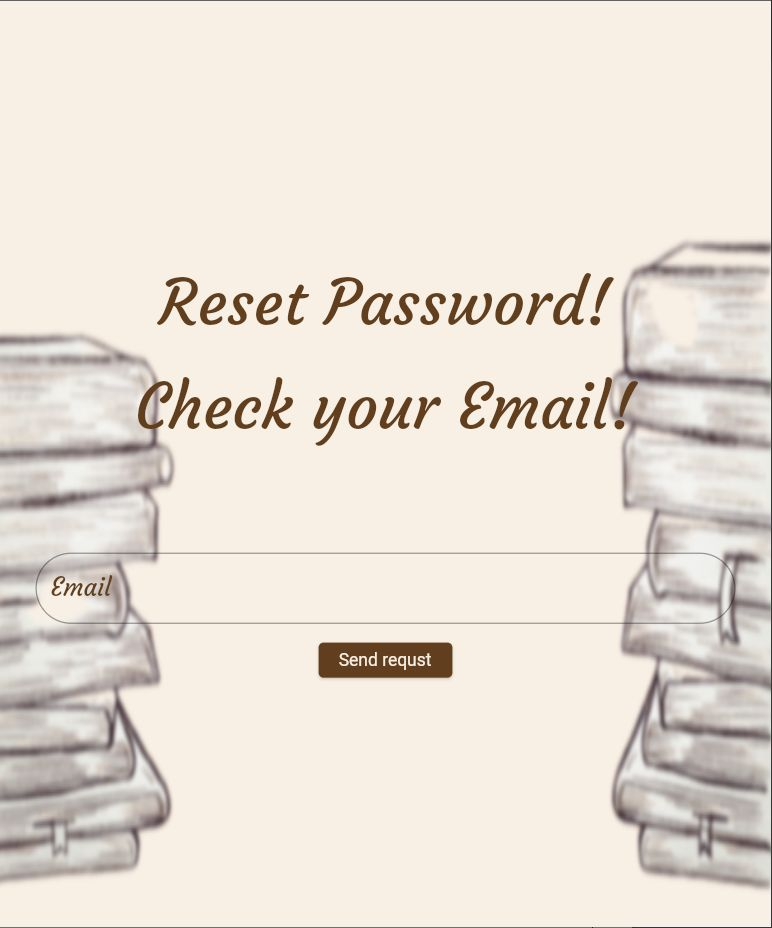
  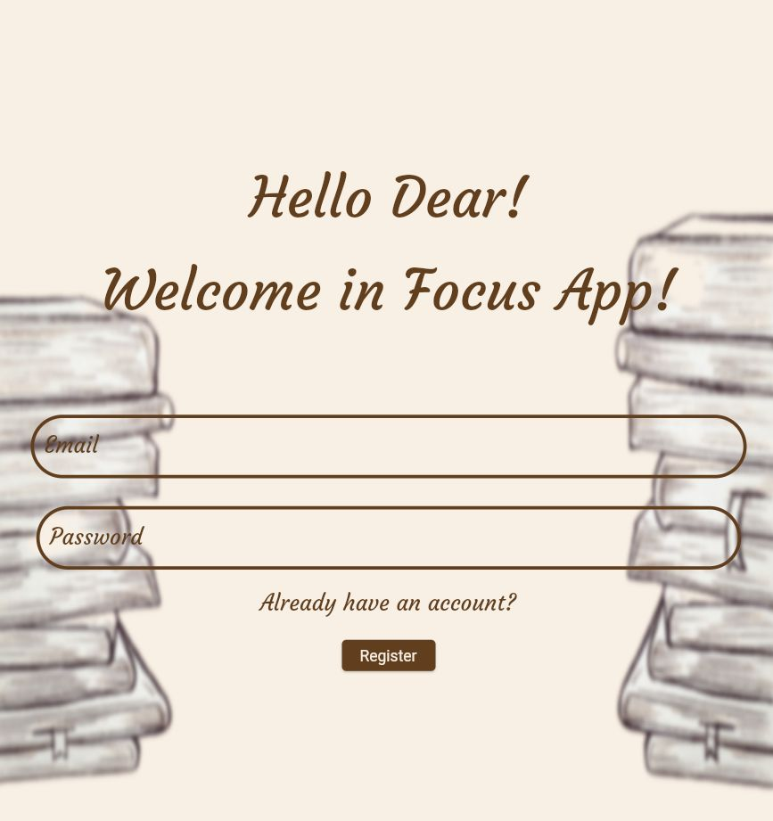
  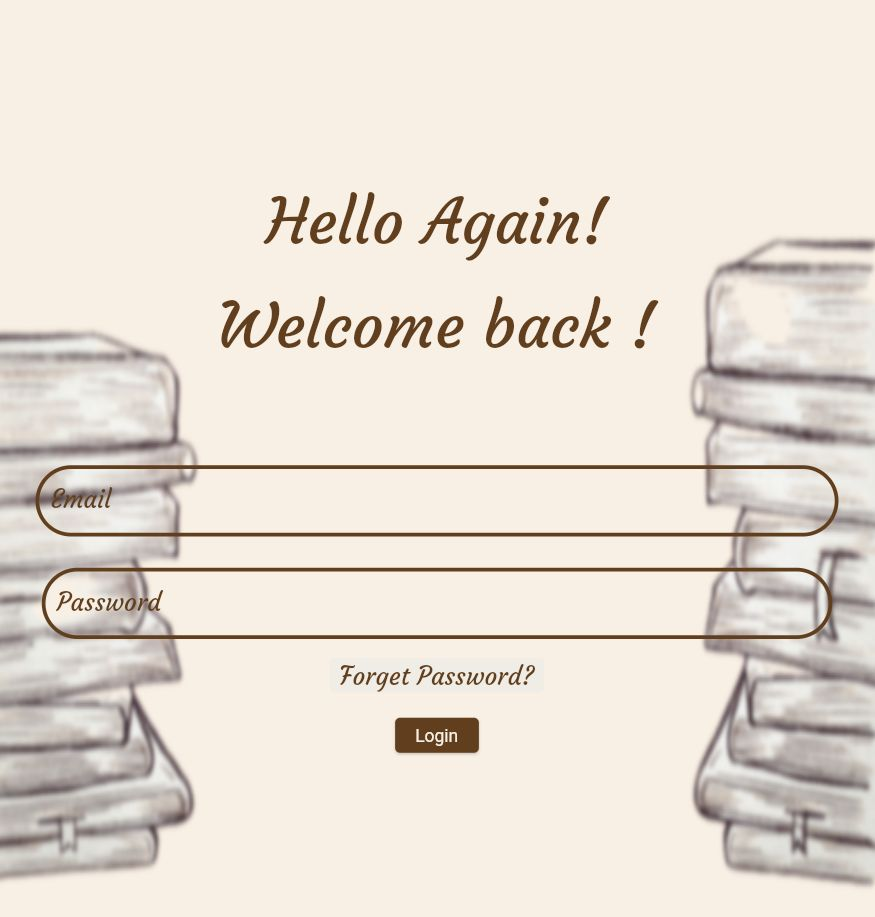
- **Home Screen**  
  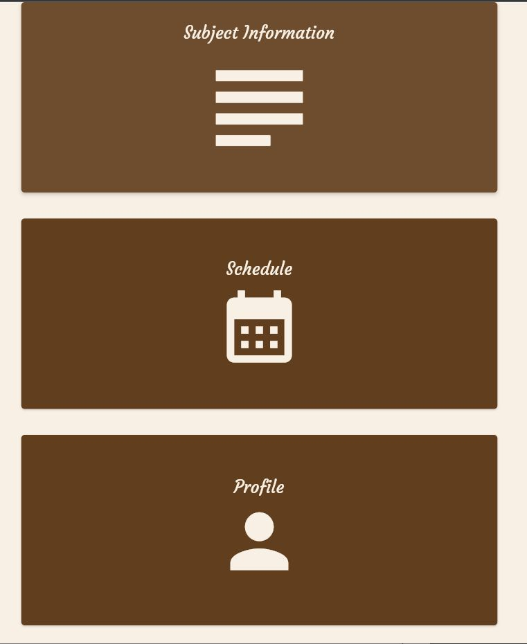

- **Subject Input Screen**  
  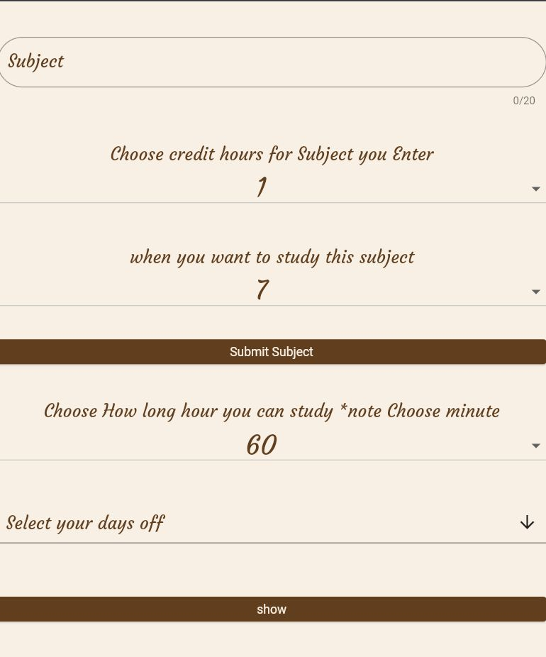

- **Schedule Screen**  
  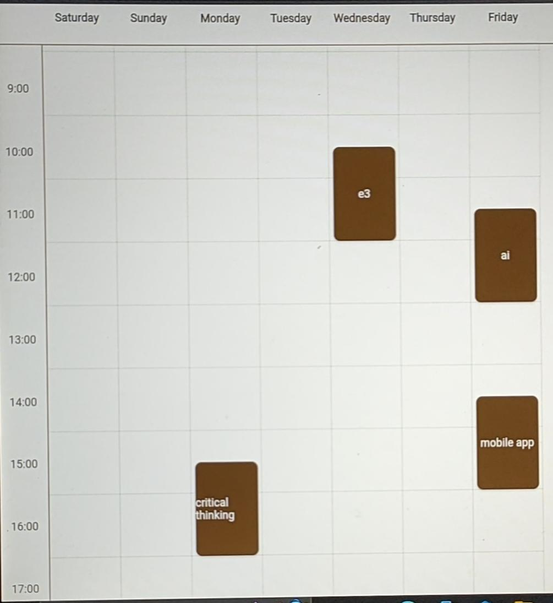

- **Profile Screen**  
  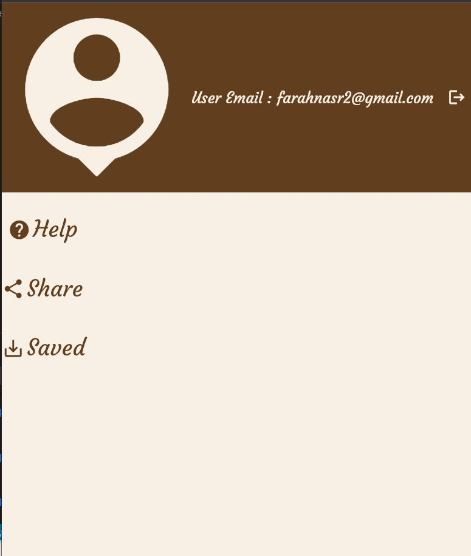

- **Help Screen**  
  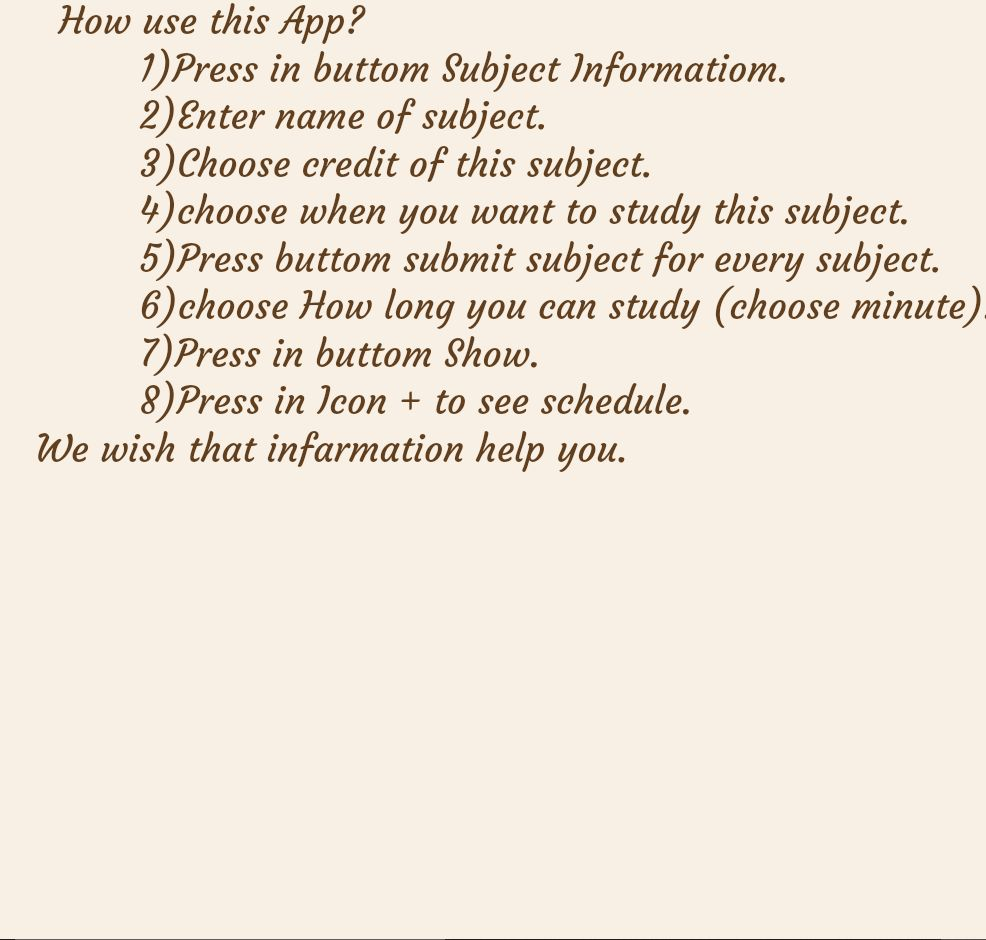

- **Save Screen**  
  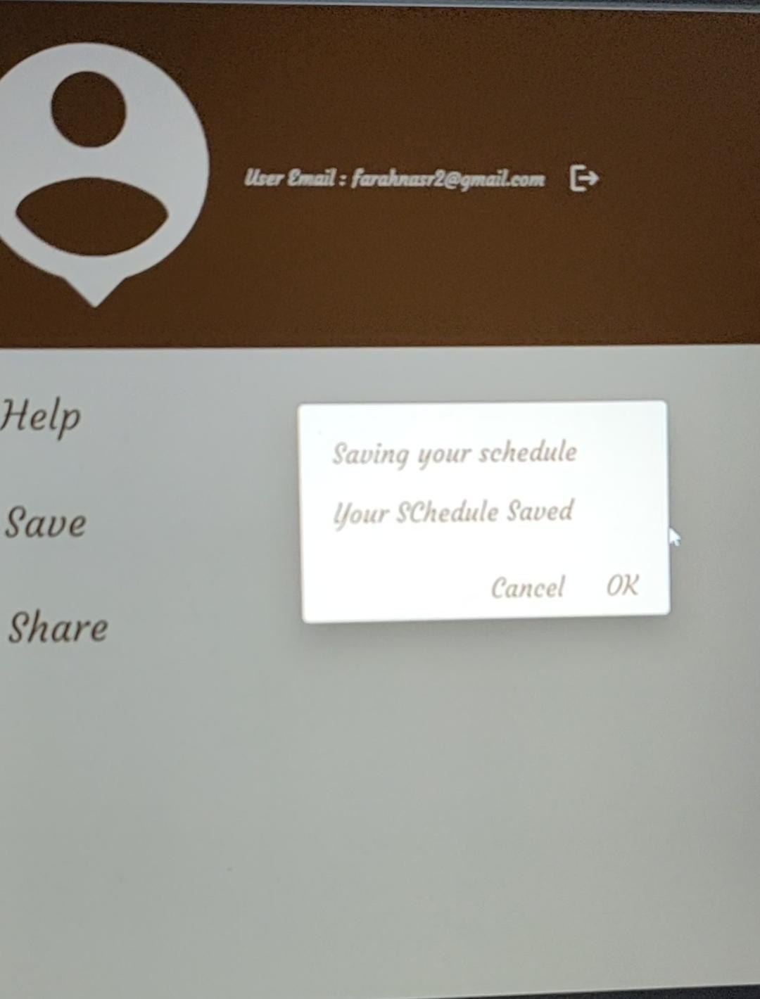

- **Share Screen**  
  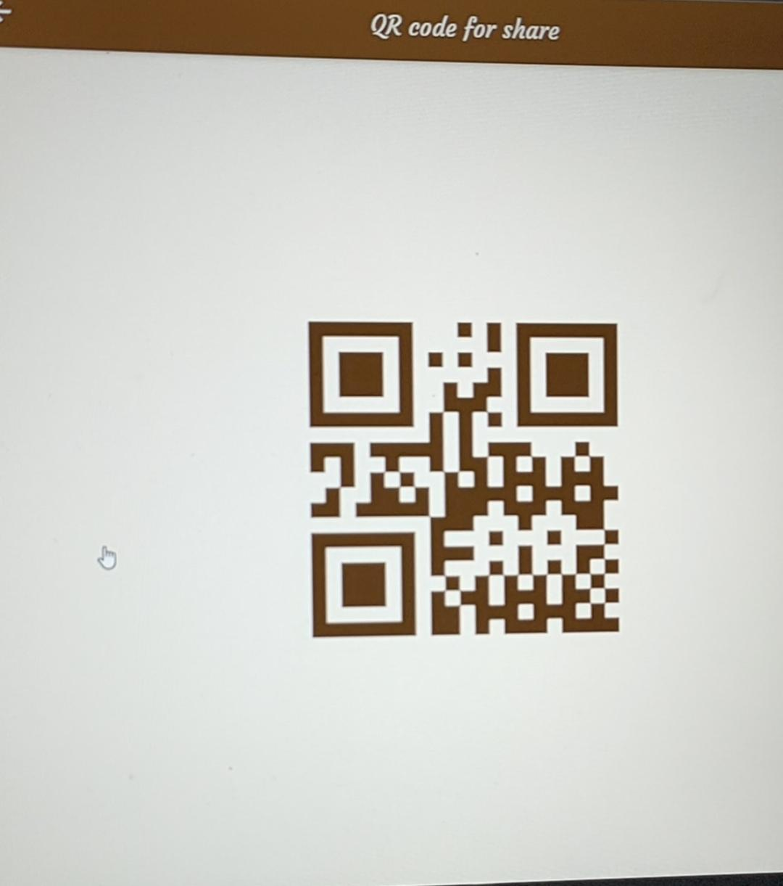
---

## 🆚 Competitors

Focus App stands out among alternatives like:

- Schedules and Daily Tasks
- Time Planner: Schedule & Tasks
- Class Timetable
- Timetable Notes
- Note Manager: Notepad App
- Simply Goals & To-Do List

---

## 💡 What Makes Focus Unique?

- Allows students to specify:
  - Credit hours per subject
  - Preferred study times
  - Days off for focused sessions
- Automatically builds a tailored weekly schedule
- Ensures high-credit-hour subjects get prioritized on days with optimal study potential

---

## 📦 How to Use the App

1. **Sign up** with your name, email, and password.
2. **Login** to your account.
3. **Add your subjects** and specify their credit hours.
4. **Choose your available study times and days off.**
5. Let **Focus App** generate an optimized weekly schedule for you.

---

## ⚙️ Technologies Used

- Flutter (for mobile development)
- Firebase (authentication and storage)
- Dart (programming language)
- Figma (UI/UX design)

---

## 📈 Future Enhancements

- 📱 Notification reminders for study sessions
- 📊 Progress tracking and analytics
- ☁️ Cloud sync for saving schedules across devices
- 🌐 Multi-language support

---

## 📞 Contact Us

For support, suggestions, or feedback:

- 📧 **Email**: farahnasr2@gmail.com
- 🐙 **GitHub**: [github.com/farahnas](https://github.com/farahnas)
